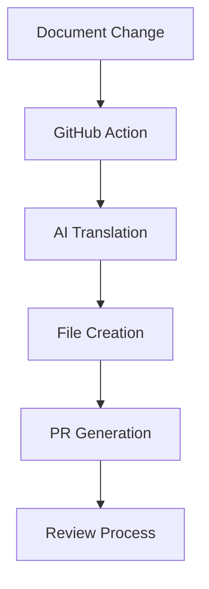

# Test Document 02 - Technical Workflow Testing

This is the second test document designed to test various technical aspects of the AI translation workflow.

> **Important**: This document contains technical terminology and complex structures to test translation accuracy.

---

## Workflow Architecture

### System Components

The auto-translate workflow consists of several key components:



### Configuration Parameters

Essential configuration for the workflow:

```yaml title="workflow-config.yml"
name: Auto Translate
on:
  push:
    branches: [feature/multilingual-docs]
    paths:
      - 'packages/web/src/content/docs/docs/*.mdx'
      - 'packages/web/src/content/docs/docs/*.md'

jobs:
  translate:
    runs-on: ubuntu-latest
    steps:
      - name: Run translation
        uses: ./auto-translate
        with:
          model: anthropic/claude-sonnet-4-20250514
          source_lang: 'en'
          target_lang: 'zh'
```

---

## Testing Scenarios

### Scenario 1: Single File Addition

When a new document is added:

1. **Detection Phase**
   - Workflow detects new file in `docs/` directory
   - Identifies file type (`.mdx` or `.md`)
   - Triggers translation process

2. **Translation Phase**
   - AI reads English content
   - Generates Chinese translation
   - Preserves formatting and structure

3. **Output Phase**
   - Creates Chinese version in `zh/docs/`
   - Maintains file hierarchy
   - Generates commit and PR

### Scenario 2: Multiple File Modifications

Complex scenarios with multiple changes:

| Change Type | Count | Expected Result |
|-------------|-------|-----------------|
| Added | 3 | 3 new Chinese documents |
| Modified | 3 | 3 updated Chinese documents |
| Deleted | 3 | 3 Chinese documents removed |

---

## Technical Specifications

### File Format Requirements

Documents must follow specific formatting:

```markdown title="format-example.md"
---
title: Document Title
description: Brief description
---

# Main Heading

## Subheading

Content with **bold** and *italic* text.

- List item 1
- List item 2

```code
// Code block
```
```

### Supported Languages

Current language support matrix:

| Language | Code | Status | Notes |
|----------|------|--------|-------|
| English | `en` | ✅ Primary | Source language |
| Chinese | `zh` | ✅ Target | Simplified Chinese |
| Japanese | `ja` | ⚠️ Planned | Future enhancement |
| Korean | `ko` | ⚠️ Planned | Future enhancement |

---

## Error Handling

### Common Issues

1. **File Path Errors**
   - Invalid file paths
   - Missing directories
   - Permission issues

2. **Translation Failures**
   - AI service unavailable
   - Content too long
   - Format corruption

3. **Git Operation Errors**
   - Branch conflicts
   - Push failures
   - PR creation issues

### Recovery Procedures

```bash title="recovery-script.sh"
#!/bin/bash

# Recovery script for failed translations
echo "Starting recovery process..."

# Check workflow status
if [ -f "workflow-failed.log" ]; then
    echo "Workflow failed, checking logs..."
    cat workflow-failed.log
fi

# Clean up failed branches
git branch | grep "auto-translate" | xargs -I {} git branch -D {}

echo "Recovery completed"
```

---

## Performance Metrics

### Translation Speed

Expected performance benchmarks:

- **Small files** (< 1KB): < 30 seconds
- **Medium files** (1-10KB): < 2 minutes  
- **Large files** (> 10KB): < 5 minutes

### Quality Metrics

Translation quality indicators:

- **Format preservation**: 100% expected
- **Technical accuracy**: > 95% expected
- **Readability**: > 90% expected
- **Consistency**: > 95% expected

---

## Future Enhancements

### Planned Features

1. **Multi-language Support**
   - Japanese translation
   - Korean translation
   - European languages

2. **Advanced AI Models**
   - GPT-4 integration
   - Custom fine-tuned models
   - Domain-specific training

3. **Workflow Improvements**
   - Batch processing
   - Incremental updates
   - Smart conflict resolution

---

## Conclusion

This test document covers:
- **Technical architecture** of the workflow
- **Testing scenarios** for various use cases
- **Performance metrics** and benchmarks
- **Error handling** and recovery procedures
- **Future enhancement** plans

Ideal for testing technical translation accuracy and workflow robustness!
