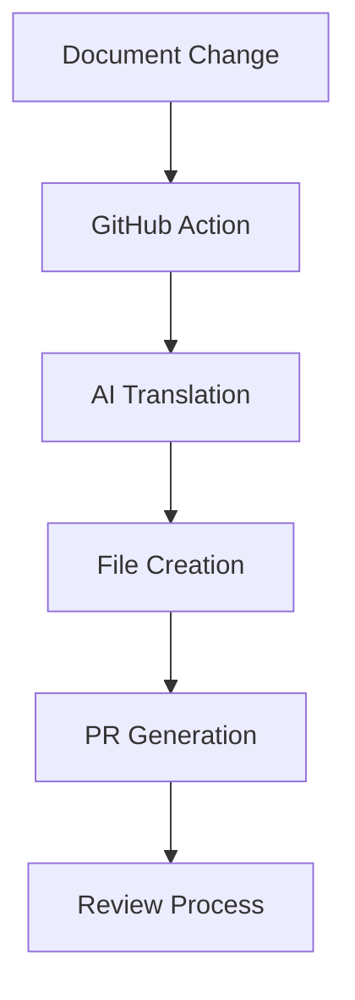

# Test Document 02 - 技术工作流程测试

这是第二个测试文档，旨在测试 AI 翻译工作流程的各种技术方面。

> **重要提示**: 此文档包含技术术语和复杂结构，以测试翻译准确性。

---

## 工作流程架构

### 系统组件

自动翻译工作流程由几个关键组件组成：



### 配置参数

工作流程的基本配置：

```yaml title="workflow-config.yml"
name: Auto Translate
on:
  push:
    branches: [feature/multilingual-docs]
    paths:
      - "packages/web/src/content/docs/docs/*.mdx"
      - "packages/web/src/content/docs/docs/*.md"

jobs:
  translate:
    runs-on: ubuntu-latest
    steps:
      - name: Run translation
        uses: ./auto-translate
        with:
          model: anthropic/claude-sonnet-4-20250514
          source_lang: "en"
          target_lang: "zh"
```

---

## 测试场景

### 场景 1: 单个文件添加

当添加新文档时：

1. **检测阶段**
   - 工作流程检测到 `docs/` 目录中的新文件
   - 识别文件类型（`.mdx` 或 `.md`）
   - 触发翻译过程

2. **翻译阶段**
   - AI 读取英文内容
   - 生成中文翻译
   - 保留格式和结构

3. **输出阶段**
   - 在 `zh/docs/` 中创建中文版本
   - 维护文件层次结构
   - 生成提交和 PR

### 场景 2: 多个文件修改

多个更改的复杂场景：

| 更改类型 | 数量 | 预期结果             |
| -------- | ---- | -------------------- |
| 已添加   | 3    | 3 个新的中文文档     |
| 已修改   | 3    | 3 个已更新的中文文档 |
| 已删除   | 3    | 3 个中文文档被移除   |

---

## 技术规格

### 文件格式要求

文档必须遵循特定格式：

````markdown title="format-example.md"
---
title: Document Title
description: Brief description
---

# Main Heading

## Subheading

Content with **bold** and _italic_ text.

- List item 1
- List item 2

```code
// Code block
```
````

````

### 支持的语言

当前语言支持矩阵：

| 语言 | 代码 | 状态 | 注释 |
|------|------|------|------|
| 英语 | `en` | ✅ 主要 | 源语言 |
| 中文 | `zh` | ✅ 目标 | 简体中文 |
| 日语 | `ja` | ⚠️ 已计划 | 未来增强功能 |
| 韩语 | `ko` | ⚠️ 已计划 | 未来增强功能 |

---

## 错误处理

### 常见问题

1. **文件路径错误**
   - 无效的文件路径
   - 缺少目录
   - 权限问题

2. **翻译失败**
   - AI 服务不可用
   - 内容过长
   - 格式损坏

3. **Git 操作错误**
   - 分支冲突
   - 推送失败
   - PR 创建问题

### 恢复程序

```bash title="recovery-script.sh"
#!/bin/bash

# Recovery script for failed translations
echo "Starting recovery process..."

# Check workflow status
if [ -f "workflow-failed.log" ]; then
    echo "Workflow failed, checking logs..."
    cat workflow-failed.log
fi

# Clean up failed branches
git branch | grep "auto-translate" | xargs -I {} git branch -D {}

echo "Recovery completed"
````

---

## 性能指标

### 翻译速度

预期性能基准：

- **小文件** (< 1KB): < 30 秒
- **中等文件** (1-10KB): < 2 分钟
- **大文件** (> 10KB): < 5 分钟

### 质量指标

翻译质量指标：

- **格式保留**: 预期 100%
- **技术准确性**: 预期 > 95%
- **可读性**: 预期 > 90%
- **一致性**: 预期 > 95%

---

## 未来增强功能

### 计划功能

1. **多语言支持**
   - 日语翻译
   - 韩语翻译
   - 欧洲语言

2. **高级 AI 模型**
   - GPT-4 集成
   - 自定义微调模型
   - 领域特定训练

3. **工作流程改进**
   - 批处理
   - 增量更新
   - 智能冲突解决

---

## 结论

此测试文档涵盖：

- 工作流程的**技术架构**
- 各种用例的**测试场景**
- **性能指标**和基准
- **错误处理**和恢复程序
- **未来增强功能**计划

非常适合测试技术翻译准确性和工作流程稳健性！
